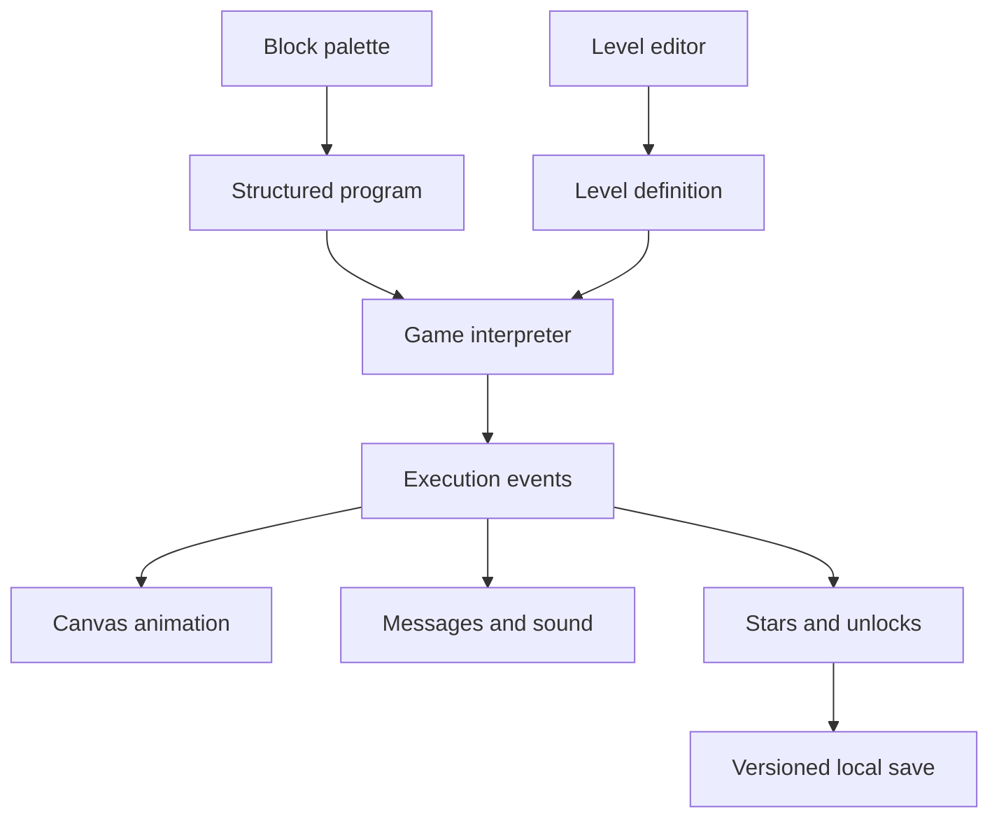
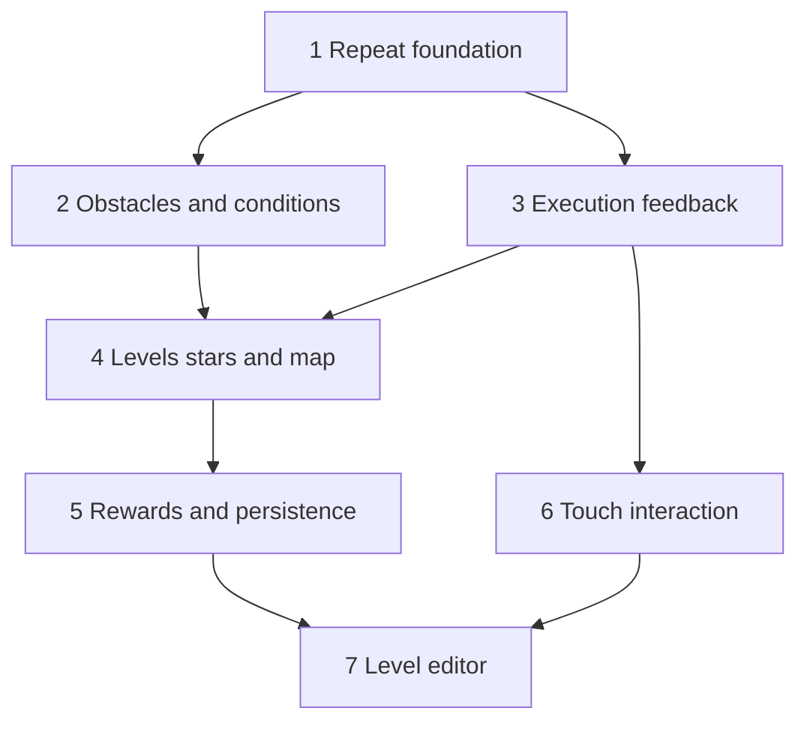

## Overview

Turtle Quest will grow from a six-level sequencing game into a progressive coding
experience for a young learner. Delivery stays incremental: each unit adds a playable,
tested capability and preserves existing level behavior.

## Problem Frame

The current game teaches sequencing with MOVE, LEFT, and RIGHT. It already executes
programs step by step, renders a visible grid, plays generated sound effects, and saves
the highest unlocked level. The next version needs deeper coding concepts, more varied
puzzles, clearer cause-and-effect feedback, stronger motivation, and dependable iPad
interaction.

## Requirements Trace

* R1. Introduce REPEAT after sequencing and simple IF branching after loops
* R2. Add walls, pits, keys and doors, and pushable blocks as progressive mechanics
* R3. Keep the grid visible and animate each executed instruction
* R4. Provide movement, collision, collection, error, and victory feedback through
  animation, sound, and gentle explanatory messages
* R5. Award one to three stars based on program efficiency without blocking completion
* R6. Provide unlockable turtle skins or crystal colors as rewards
* R7. Replace the linear level strip with a map showing locks, completion, and stars
* R8. Support large touch targets, direct block manipulation, portrait and landscape
  layouts, and visible press feedback
* R9. Add a level editor for creating and playing local puzzles
* R10. Persist progress, ratings, rewards, preferences, and local creations without login

## Scope Boundaries

* Keep the app framework-free and deployable as static files
* Keep progress local to the browser; accounts and cloud synchronization are out of scope
* Introduce one coding concept at a time instead of exposing all blocks on early levels
* Use tap-to-add as the dependable baseline; drag and reorder enhance it but do not replace it
* Keep authored levels local in the first editor release; public sharing is out of scope
* Preserve reduced-motion and muted-sound preferences

## Context and Research

### Relevant Code and Patterns

* `src/game.js` owns deterministic, immutable state transitions and program execution
* `src/levels.js` uses data-defined puzzles with executable reference solutions
* `src/app.js` owns canvas primitives, step timing, DOM rendering, and browser persistence
* `src/audio.js` synthesizes short effects without external assets
* `test/game.test.js` covers engine behavior and `test/levels.test.js` validates every level
* `tools/build.mjs` copies the static application into `dist/`

### Institutional Learnings

No existing `docs/solutions/` guidance was found.

### External References

External research is deferred. The first units extend established local browser and
JavaScript patterns without adding dependencies or external contracts.

## Key Technical Decisions

* Represent programs as nested data nodes while continuing to accept existing command
  strings. This supports loops and conditions without breaking current levels.
* Separate program execution from presentation. The engine will produce deterministic
  steps or events, while `src/app.js` controls timing, canvas interpolation, and effects.
* Treat obstacle behavior as engine state, not canvas behavior. Tests can then prove keys,
  doors, pits, and pushing without a browser.
* Version one structured localStorage document and migrate the current unlock value. This
  prevents separate keys and incompatible progress formats from accumulating.
* Calculate stars from authored block-cost thresholds. Runtime instruction count remains
  visible feedback but does not penalize legitimate use of loops.
* Keep accessibility paths equivalent: every drag action also has tap and button controls.

## Open Questions

### Resolved During Planning

* Existing level compatibility: preserve flat command arrays as valid programs
* Failure behavior: stop execution on a terminal pit and pause on a blocked move with a
  specific, friendly reason
* First delivery: build REPEAT engine support before adding its level and interface

### Deferred to Implementation

* IF predicates: choose the smallest useful set after keys, doors, pits, and pushables have
  stable state semantics
* Animation technique: select interpolation details after measuring canvas behavior on
  desktop and iPad-sized viewports
* Star thresholds: tune against playable solutions after the expanded level set exists
* Reward cadence: decide exact unlock milestones once the number of levels is known
* Editor validation: finalize publish rules after all tile schemas are stable

## High-Level Technical Design

> This illustrates the intended approach and is directional guidance for review, not
> implementation specification. The implementing agent should treat it as context, not
> code to reproduce.

## Implementation Units

### Unit 1: Structured Programs and REPEAT

* [x] Implement structured program execution and the first REPEAT block

Goal: Establish the nested program model and let learners repeat a body two to five times.

Requirements: R1, R3

Dependencies: None

Files:

* Modify `src/game.js`, `src/app.js`, `src/levels.js`, `index.html`, and `styles.css`
* Test `test/game.test.js` and `test/levels.test.js`

Approach:

* Add a repeat node with a bounded count and nested body
* Preserve command strings and define block cost separately from executed instruction count
* Add REPEAT only to levels that teach or follow the concept
* Render the nested block clearly and highlight both the source block and repeated body steps

Execution note: Implement the interpreter behavior test-first.

Patterns to follow:

* Immutable transitions and explicit unknown-command errors in `src/game.js`
* Data-defined command budgets and solutions in `src/levels.js`

Test scenarios:

* Happy path: repeating MOVE three times advances three cells and collects the target
* Happy path: a turn inside a repeat changes direction on every iteration
* Edge case: an empty repeat body makes no state changes
* Error path: counts outside the supported range and malformed nodes are rejected
* Integration: every old flat solution and a new repeat-based level solution completes

Verification:

* Existing levels remain playable and a learner can solve the introductory loop level
* Tests distinguish authored block cost from runtime instruction count

### Unit 2: Obstacles and IF Conditions

* [ ] Add progressive puzzle objects and condition-aware execution

Goal: Add walls, pits, keys, doors, and pushable blocks, then introduce IF with predicates
that directly support those mechanics.

Requirements: R1, R2, R4

Dependencies: Unit 1

Files:

* Modify `src/game.js`, `src/levels.js`, `src/app.js`, `src/audio.js`, `index.html`, and
  `styles.css`
* Test `test/game.test.js` and `test/levels.test.js`

Approach:

* Define tile collections in level data and mutable inventory, door, and pushable state in
  game state
* Give each failed movement a reason such as edge, wall, locked door, immovable block, or pit
* Introduce a small predicate menu based on stable mechanics, such as path ahead or has key

Execution note: Add engine tests for each mechanic before canvas rendering.

Patterns to follow:

* Coordinate-string level data in `src/levels.js`
* Pure engine state transitions in `src/game.js`

Test scenarios:

* Happy path: collecting a key opens its door and permits movement
* Happy path: a pushable moves into a free cell when the turtle advances
* Happy path: IF executes only when its predicate is true
* Edge case: a pushable cannot move beyond the board or into another occupied cell
* Error path: walls and locked doors keep the turtle in place with distinct reasons
* Error path: entering a pit ends the attempt and does not complete the level
* Integration: every mechanic-specific reference solution completes within its block budget

Verification:

* Each mechanic is visually distinct, explained on collision, and covered by a playable level

### Unit 3: Animation, Sound, and Gentle Feedback

* [ ] Produce richer execution events and presentation feedback

Goal: Make every instruction legible through movement, turns, collisions, collection, and
victory effects.

Requirements: R3, R4

Dependencies: Unit 1; coordinate with Unit 2 failure reasons

Files:

* Modify `src/game.js`, `src/app.js`, `src/audio.js`, and `styles.css`
* Test `test/game.test.js`

Approach:

* Expose deterministic execution events from the engine
* Interpolate turtle movement and rotation between cells using animation frames
* Add short sparkle, bounce, and shake effects with reduced-motion fallbacks
* Pair each failure reason with plain, encouraging language and a distinct sound

Patterns to follow:

* Async step runner and active-program highlighting in `src/app.js`
* Generated Web Audio effects in `src/audio.js`

Test scenarios:

* Happy path: execution events retain source-block identity across repeated steps
* Edge case: reduced-motion mode skips interpolation while preserving step order
* Error path: a blocked event includes its reason and halts or pauses according to policy
* Integration: canvas, message, sound, and active block update from the same event

Verification:

* A learner can identify which block ran, what moved, and why an attempt stopped

### Unit 4: Expanded Levels, Stars, and Quest Map

* [ ] Build the progressive curriculum and visual level map

Goal: Sequence mechanics from movement through loops and conditions, with visible progress
and optional optimization goals.

Requirements: R1, R2, R5, R7

Dependencies: Units 2 and 3

Files:

* Modify `src/levels.js`, `src/game.js`, `src/app.js`, `index.html`, and `styles.css`
* Test `test/game.test.js` and `test/levels.test.js`

Approach:

* Group levels into sequencing, loops, obstacles, and conditions
* Author one concept introduction followed by reinforcement levels
* Award one star for completion and additional stars for authored block-cost thresholds
* Render a navigable quest map with current, completed, locked, and star states

Test scenarios:

* Happy path: each reference solution earns its authored target rating
* Happy path: completing a level unlocks only the intended next node
* Edge case: replaying with a lower score never reduces stored stars
* Error path: invalid or impossible level definitions fail validation in tests
* Integration: all reference solutions collect required goals within their limits

Verification:

* The full level ladder is playable in order and map state matches recorded progress

### Unit 5: Rewards and Versioned Local Progress

* [ ] Persist progress and add cosmetic rewards

Goal: Save stars, unlocks, sound preference, selected cosmetics, and earned rewards in one
versioned local profile.

Requirements: R6, R10

Dependencies: Unit 4

Files:

* Create `src/progress.js` and `test/progress.test.js`
* Modify `src/app.js`, `src/levels.js`, `index.html`, and `styles.css`

Approach:

* Migrate `turtleQuestLevel` into a validated versioned profile
* Unlock a small set of turtle skins and crystal colors from star milestones
* Ignore malformed stored data and recover to a valid profile without losing known fields

Execution note: Implement storage serialization and migration test-first.

Test scenarios:

* Happy path: stars and selected rewards survive a reload
* Happy path: the old unlocked-level value migrates into the new profile
* Edge case: completing a level twice keeps the best stars
* Error path: malformed or future-version data falls back without crashing startup
* Integration: earning a milestone unlocks and renders its reward

Verification:

* Progress and preferences persist across sessions without login

### Unit 6: Touch and Responsive Interaction

* [ ] Polish program editing and layouts for iPad use

Goal: Make every core workflow comfortable in portrait and landscape with touch, keyboard,
and pointer input.

Requirements: R8

Dependencies: Unit 3; can proceed alongside Units 4 and 5

Files:

* Modify `src/app.js`, `index.html`, and `styles.css`
* Create `test/ui.test.js` if browser test infrastructure is introduced

Approach:

* Increase all interactive targets to at least 48 pixels and stabilize control dimensions
* Add pointer-based block reordering with tap-accessible move and remove controls
* Add visible pressed states and prevent accidental double activation while running
* Tune layout at tablet portrait, tablet landscape, and narrow phone widths

Test scenarios:

* Happy path: touch can add, reorder, remove, clear, and run a program
* Edge case: rotating between portrait and landscape preserves the current program
* Edge case: long labels and maximum program size do not overlap controls
* Integration: pointer, keyboard, and tap alternatives produce the same program data

Verification:

* Browser checks pass at 768 by 1024, 1024 by 768, and a narrow mobile viewport

### Unit 7: Local Level Editor

* [ ] Add create, validate, play-test, and save workflows for custom puzzles

Goal: Let a child build a valid puzzle locally and immediately play it.

Requirements: R2, R9, R10

Dependencies: Units 5 and 6

Files:

* Create `src/editor.js` and `test/editor.test.js`
* Modify `src/levels.js`, `src/progress.js`, `src/app.js`, `index.html`, and `styles.css`

Approach:

* Use a mode-based grid tool with tile swatches, start direction, goals, and block budget
* Validate one start, at least one goal, in-bounds tiles, and non-overlapping exclusive tiles
* Save a bounded number of versioned local levels and keep edit mode separate from play mode

Test scenarios:

* Happy path: a valid custom level saves, reloads, and can be completed in play mode
* Edge case: changing board size removes or reports out-of-bounds tiles predictably
* Error path: missing starts, goals, or overlapping exclusive tiles cannot be saved
* Error path: malformed saved levels are skipped without breaking built-in levels
* Integration: editor output uses the same engine and renderer as authored levels

Verification:

* A custom puzzle can be created, validated, saved, reopened, and solved offline

## System-Wide Impact

* Interaction graph: palette and editor produce structured programs and levels; the engine
  emits state and events; canvas, sound, messages, ratings, and persistence consume them
* Error propagation: authoring errors throw during tests or editor validation; player errors
  become typed outcomes with gentle messages
* State lifecycle risks: profile writes must retain best scores and avoid partial corruption
* API surface parity: pointer, keyboard, and accessible controls mutate the same program model
* Integration coverage: reference-solution tests cover levels and engine; browser checks cover
  rendering, input, layout, and persistence
* Unchanged invariants: old command strings remain valid and the app remains static-hostable

## Success Metrics

* Every built-in level has a passing reference solution and concept metadata
* A failed move always produces a visible reason
* A returning player recovers unlocks, best stars, and selected rewards
* Core workflows remain usable at all three target touch viewports
* No unit is pushed unless focused tests and the full build pass

## Risks and Mitigations

| Risk | Likelihood | Impact | Mitigation |
|------|------------|--------|------------|
| Nested blocks make editing confusing | Medium | High | Introduce REPEAT alone and retain tap-first controls |
| New mechanics create ambiguous collisions | Medium | High | Centralize precedence in pure engine tests |
| Canvas animation drifts from game state | Medium | High | Render one deterministic event stream |
| localStorage changes lose progress | Low | High | Version, validate, migrate, and retain best scores |
| Touch reordering conflicts with scrolling | Medium | Medium | Use pointer capture, clear handles, and tap alternatives |
| The editor permits impossible puzzles | High | Medium | Validate structure and require play-testing, without claiming solvability proof |

## Delivery and Progress Tracking

Each unit is an independently tested commit and push. Update the checkbox above and the
companion progress ledger after every completed unit. Use
`docs/progress/gameplay-depth-progress.md` as the resume entry point for later sessions.

## Documentation and Operational Notes

* Keep deployment infrastructure unchanged unless a later browser-test dependency requires it
* Run focused tests during each unit, then the full test suite and production build before push
* Validate the deployed Static Web App after milestone units that change user-facing behavior

## Sources and References

* Enhancement ideas supplied in the 2026-08-27 user request
* Related engine: `src/game.js`
* Related levels: `src/levels.js`
* Related browser controller: `src/app.js`
